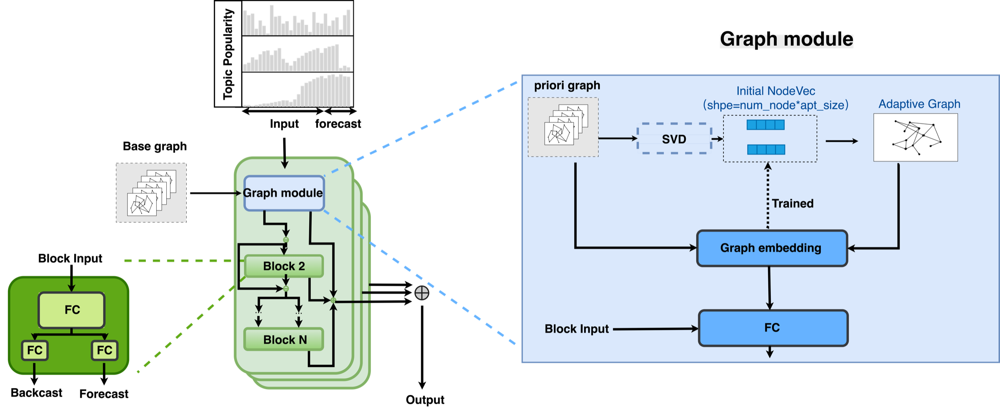
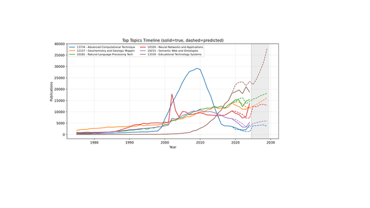
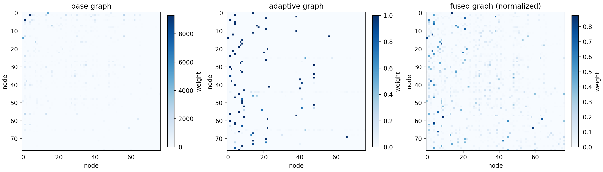

# AG-FC: Adaptive Graph Forecasting for Scientific Topic Popularity

This repository contains the implementation and experiment pipeline for the paper *Learning Adaptive Graphs to Uncover Potential Relationships for Scientific Topic Popularity Trend Forecasting*.  
The main entry point is `dynamic_run_snapshot.py`.

## 1. Objective

This project formulates scientific topic popularity forecasting as a **graph-aware multivariate time-series forecasting** task:

- Nodes: topics or subfields (depending on dataset granularity)
- Time axis: yearly publication volume (1975--2024)
- Target: predict future `H` steps from a historical window (`H=1` in the paper's main setting)

Key findings reported in the paper:

- AG-FC achieves **12/24** top-1 results in the main benchmark.
- On subfield-level datasets, AG-FC achieves **11/12** top-1 results.
- AG-FC outperforms FC-GAGA and FC-GAGA (without graph gate) in **20/24** and **21/24** settings, respectively.

## 2. Method-to-Code Mapping

`dynamic_run_snapshot.py` exposes three graph modes (`--graph_mode`):

- `basegraph`: use only base graphs (fused from sliding-window snapshots)
- `adaptiveonly`: use only adaptive graphs (learned from node embeddings)
- `hybrid`: fuse base graph and adaptive graph (supports SVD initialization)

Core modules:

- Dynamic snapshot loading and window fusion: `dynamic/dynamic_graph_provider.py`
- Adaptive adjacency learning and hybrid fusion: `dynamic/dynamic_adaptive_layers.py`
- FC-GAGA backbone and graph operators (GCN/GAT/GraphSAGE): `dynamic/dynamic_model_snapshot.py`
- Data split and sample generation: `dynamic/dynamic_generate_training_data.py`

## 3. Framework Figure

Framework overview:



## 4. Data Organization

The repository currently includes 8 OpenAlex subsets (4 domains + 4 subfields):

- `data/oa_1`, `data/oa_2`, `data/oa_3`, `data/oa_4`
- `data/oa_1702`, `data/oa_1705`, `data/oa_1707`, `data/oa_1710`

Each subset contains:

- `*_covert.csv`: yearly node time series (rows = years, columns = nodes)
- `*_coo_pkl/`: yearly co-occurrence adjacency snapshots (`{subset}_cooccur_{year}.pkl`)
- `*_coo/`: Excel versions for analysis

Default script arguments are set to `oa_2`.

## 5. Environment

Recommended Python: `3.10` or `3.11`.

Core dependencies:

- `tensorflow`
- `numpy`
- `pandas`
- `gdown`

Example installation:

```bash
pip install tensorflow numpy pandas gdown
```

## 6. Quick Start

### 6.1 Default run (oa_2)

```bash
python dynamic_run_snapshot.py
```

### 6.2 Common reproduction setting: Adaptive Only (without SVD)

```bash
python dynamic_run_snapshot.py \
  --data_csv data/oa_1702/oa_1702_covert.csv \
  --adjacency_dir data/oa_1702/oa_1702_coo_pkl \
  --adjacency_pattern "1702_cooccur_{year}.pkl" \
  --graph_mode adaptiveonly \
  --adaptive_init random \
  --graph_layer_type graphsage \
  --history_length 5 \
  --horizon 1
```

### 6.3 Hybrid + SVD (accuracy + prior consistency)

```bash
python dynamic_run_snapshot.py \
  --data_csv data/oa_1702/oa_1702_covert.csv \
  --adjacency_dir data/oa_1702/oa_1702_coo_pkl \
  --adjacency_pattern "1702_cooccur_{year}.pkl" \
  --graph_mode hybrid \
  --adjacency_fusion mean \
  --adaptive_init mean \
  --graph_layer_type graphsage \
  --history_length 5 \
  --horizon 1
```

## 7. Key Arguments

| Argument | Description | Typical values |
|---|---|---|
| `--graph_mode` | Graph modeling mode | `basegraph` / `adaptiveonly` / `hybrid` |
| `--adjacency_fusion` | Base-graph snapshot fusion strategy | `last` / `sum` / `mean` / `learned_decay` |
| `--adaptive_init` | Adaptive graph initialization | `last` / `sum` / `mean` / `random` |
| `--graph_layer_type` | Graph encoder type | `none` / `gcn` / `gat` / `graphsage` |
| `--history_length` | Historical look-back window | default `5` |
| `--horizon` | Forecast horizon | default `1` |
| `--apt_size` | Low-rank size for adaptive adjacency | typically `10` |
| `--use_time_gate` | Enable temporal gate | disabled by default |

## 8. Outputs

Each run creates an experiment folder under `dynamic_results0130/`. Typical artifacts:

- `config.json`: CLI args + hyperparameters
- `metrics.json`: overall and per-horizon metrics
- `prediction_by_node_year.csv`: per-node, per-year predictions
- `node_error_summary.csv`: node-level error summary
- `y_true.npy` / `y_pred.npy`: labels and predictions
- `adaptive_adj.npy` / `adaptive_adj_pure.npy`: fused and pure adaptive adjacency (adaptive modes)
- `base_graph.npy` / `base_graph_raw.npy`: base graph artifacts (base/hybrid modes)
- `best_weights.weights.h5`: best checkpoint weights
- `dynamic_saved_model/`: exported SavedModel

A run index is appended to `dynamic_results0130/results_index.csv`.

## 9. Paper Result Snapshots

Summary files used in this README:

- `docs/readme_assets/paper_result_summary.csv`
- `docs/readme_assets/paper_main_table_top1_by_model.csv`

Main table top-1 counts (Table 5 aggregate):

| Model | Top-1 Count |
|---|---:|
| AG-FC | 12 |
| SARIMAX | 8 |
| FC-GAGA | 3 |
| LSTM | 1 |
| FC-GAGA (without graph gate) | 0 |
| NeuralProphet | 0 |
| Informer | 0 |
| TimeX++ | 0 |

GraphSAGE is the most stable graph operator in ablation (Top-1: 16/24, Top-3: 52/72).

## 10. Additional Figures

Subfield 1702 five-year trend visualization:



Subfield 1702 topology transition (base → adaptive → fused):



## 11. Citation

If this repository helps your research, please cite:

```text
Learning Adaptive Graphs to Uncover Potential Relationships for Scientific Topic Popularity Trend Forecasting
Changwang Li, Xuecan Tian, Zeyu Deng, Jin Mao
```
